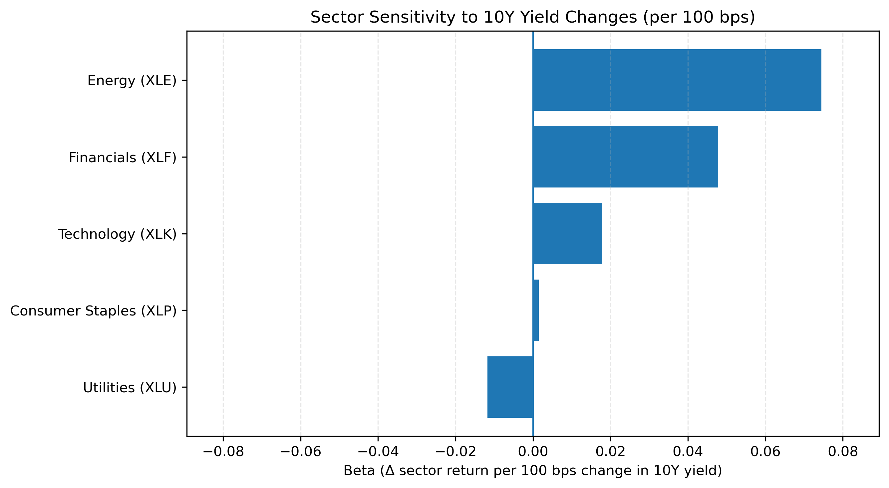

# Sector Rate Sensitivity

## Project Overvies & Motivation
This project analyzes how different equity sectors respond to changes in U.S. interest rates, with the goal of identifying relative sensitivity and defensive characteristics across industries.

## Research Questions
- How sensitive are sector-level equity returns to changes in U.S. interest rates?
- Do different sectors exhibit heterogeneous responses to interest rate movements?

## Data Sources
- Sector-level equity returns (sector ETFs, e.g., XLE, XLF, XLK) from public market data sources.
- U.S. 10-year Treasury (DGS10) yield data from public economic data sources.

## Methodology
- Rate sensitivity differs substantially across sectors, with financials and energy exhibiting higher exposure relative to defensive sectors.
- Construct time-series returns for sector-level equities.
- Estimate sector-specific interest rate exposure using regression-based models.
- Compare sensitivity estimates across sectors via cross-sectional analysis.

## Key Results
- Interest rate sensitivity varies meaningfully across equity sectors
- Some sectors demonstrate more defensive behaviors during rising-rate periods.
- Results highlight heterogeneity in sector exposure to interest-rate risk.

## Visualizations
The figure below summarizes estimated sector sensitivity to changes in the U.S. 10-year Treasury yield.
Betas are interpreted as the change in daily sector returns per 100 basis point (1%) change in the 10Y yield.



## How to Reproduce
Clone this repository:
   ```bash
   git clone https://github.com/Joe-creates777/Sector-rate-sensitivity.git
   cd Sector-rate-sensitivity

Install dependencies:
```bash
   pip install -r requirements.txt
